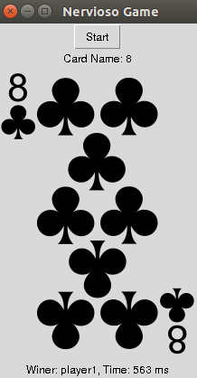
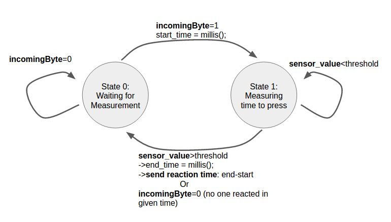

# Reaction Measurement: Part 2

This week we will continue with the reaction measuring time of our brains/hands by using the the sensor switch constructed last [week](https://github.com/jpduarteeecs/hardwaremakers/blob/master/labs_sp17/pressuresensor/pressure_sensor.md) and a GUI that we will be constructing.

We will play the Nervioso game, which takes all your power brain and physical capabilities to react fast and win!


## Powerful but heavy with simple but light computer

A combination of a powerful but heavy computer (like you PC or a Raspberry Pi) with a simple but light computer (like an Arduino or a RedBear Duo) is a perfect match for real time applications. Especially for those where a bit more CPU power is needed for control or GUI display, while continuous sensing and data collection is carried out in the smaller hardware.


## GUIs

There are several GUI toolkits that you can use, from very simple GUIs, when you want draw some graphics quickly and flexibly, to much more complex ones, generally more robust, complex, and standard. In this experience we are going to use [Tkinter](https://www.youtube.com/watch?v=RJB1Ek2Ko_Y&list=PL6gx4Cwl9DGBwibXFtPtflztSNPGuIB_d), which is good enough for our proposes. However, in case you want more options, take a look at the following lists:

Some big toolkits are (very complex and take significant time to learn initially):
* Cocoa (using Obj-C or Swift) on OS X
* WPF in C#+XAML on Windows
* Qt (cross-platform, C/C++/Python bindings)

Some tools for fast experimentation are:
* OpenFrameworks and Cinder are similar in orientation to Processing, but C++ - based
* pyGame
* Processing 3

You can also write a web app for you GUI. However, browsers are sandboxed and know nothing about your serial port. Therefore, you'll have to write your own server that opens a serial port and relays all that data to the client. It requires a sophisticated understanding of web app architecture / HTTP and sockets (good luck with that!).

For games, we strongly recommend you to use the game engine [Unity 3D](https://unity3d.com/), you can create awesome 2D/3D games, virtual reality games, and interface it with your hardware as well (for controlling or display). The community that uses Unity 3D is huge, there are a lot of tutorials, and you can get started in a weekend.  It is free to use until your company makes more than $100K.

## Nervioso Game's GUI :black_joker:

The Nervioso game is played by choosing random cards while counting cards in order. If the card that you choose matches the card name that you say, then you need to press your switch as fast as you can. Last player loses. The GUI python code for the Nervioso game can be found [here](https://github.com/jpduarteeecs/hardwaremakers/blob/master/labs_sp17/pressuresensor/nervioso_game.py) (:warning: remember to change serial port name, and folder path to your card images :warning:).



We basically need the following features for the GUI:

* A button to start/stop the game: `button_1 = Button(root, textvariable=var_start_stop)`. Every time this button is clicked, it call the function `def printName(event):` to update the button display and to stop the game
* A Label to display the current card number `l = Label(root, textvariable = var)`
* A image to display the card to match `img = ImageTk.PhotoImage(Image.open(path))`

In the functionally part, we need the following requirements:

* Random generator that choose the next card every certain amount of time (`time_elapse_card`). This is done by using `random.choice(number_of)` and `random.choice(suite_png)` . They randomly choose a number and a suit for the next card respectively. Then the card to be displayed is updated in the GUI.
* A serial connection that read the data from the switch.
* If a match is found, program waits from the hardware to send data about pressing time. If that happens. Game stop.

Serial connection is a bit tricky while using a GUI like Tkinter. While waiting for input from pySerial's Serial object, the serial communications actually blocks the program, which means that it will prevent your GUI from being responsive. The process cannot update buttons or react to input because it is busy waiting for the serial to say something, and that may never happen! or happen rarely. To solve this we need two key elements:

 * Make sure the reading from serial is non-blocking (Serial.read() and Serial.readline() will hold up the whole program until it has enough information to give). This problem is solved with the timeout=0 option when initializing the Serial object, which will cause it to return nothing unless something is already waiting in the Serial object's buffer: `ser = Serial(serialPort , baudRate, timeout=0, writeTimeout=0)`
 * Update the GUI using `root.after(milliseconds, function_to_call)` method to run a non-blocking version of read in the tkinter main loop. Keep in mind that when TkInter gets to the root.mainloop() method, it is running its own while loop. It needs the things in there to run every now and then in order to make the interface respond to interactions.

## RedBear Code for Nervioso Game :black_joker:

While a simple game as the Nervioso Game maybe implemented purely in your computer, your powerful but heavy computer is running many stuff at the same time, so it may stop here and there, and your sensing measurement would not be continuous or precise. To solve this issue, the sensing part can be implemented a simpler hardware, which sensor timing and synchronization can be carefully controlled.

For the Nervioso game, we have planned the following state machine, which takes inputs from the computer (using serial communication) and the pressure or switch sensors. The output is the response time for a match event from the card game:



Please use the following [code](https://github.com/jpduarteeecs/hardwaremakers/blob/master/labs_sp17/pressuresensor/analog_pressure_sensor_game/analog_pressure_sensor_game.ino) in your RedBear Duo. Note that the state machine is implemented using the command `switch (state)`.


```Arduino
#if defined(ARDUINO)
SYSTEM_MODE(MANUAL);
#endif

int LED = D7;                         // LED is connected to D7
int analog_read = A1;
int analog_value;
int state = 0;
char incomingByte = '0'; // for incoming serial data
unsigned long start_time, end_time;

void setup() {
  Serial.begin (9600);
  pinMode(LED, OUTPUT);               // sets pin as output
  pinMode(analog_read, INPUT);  
}

void loop()
{

  switch (state)
  {
    case 0://waiting for measuring
      state = 0;
      if(Serial.available()){
          incomingByte = Serial.read(); // read the incoming data

          if (incomingByte=='1') {
            state=1;
            start_time = millis();
          }        
        }      
      break;
    case 1: //calculate time response
      end_time = millis();
      analog_value = analogRead(analog_read);
      if(analog_value>4000){
        Serial.println(end_time-start_time);
        state = 0;
      } else {
        if(Serial.available()){
          incomingByte = Serial.read(); // read the incoming data
        }  
        if (incomingByte=='0') {
          state=0;
        }         
      }
      break;
    default:
      state = 0;
  }
}
```

## Multiplayer
